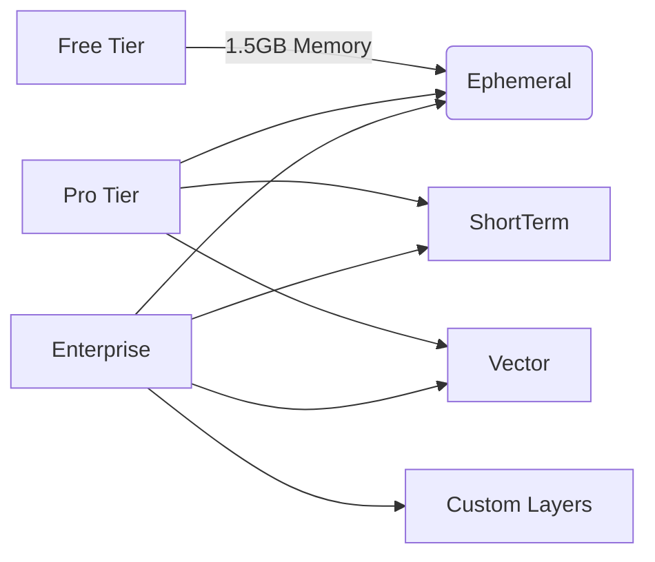

# CapyIDE Business Alignment Matrix

## 1. Pricing Tier Capability Mapping

| Capability | Free Tier | Pro Tier | Enterprise Tier |
|------------|-----------|----------|-----------------|
| **Memory Layers** | Ephemeral (1.5GB) | Ephemeral + ShortTerm + Vector (10GB+) | All layers + custom (Unlimited) |
| **AI Models** | Basic models (200 req/mo) | GPT-4, Claude 3, CodeLlama (Unlimited) | Claude Opus, GPT-4o Extended + custom tuning |
| **Core Features** | Basic context recall | Priority context recall, SSO, Audit logs | Predictive recall, 24/7 support, Custom SLA |
| **Deployment** | Cloud-only | Cloud + Hybrid | On-prem/Hybrid with dedicated instances |

## 2. Feature Flags

```typescript
// Feature flag configuration
const FEATURE_FLAGS = {
  MAX_MEMORY_EPHEMERAL: process.env.TIER === 'free' ? 1.5 : null,
  ENABLE_VECTOR_LAYER: ['pro', 'enterprise'].includes(process.env.TIER),
  ENABLE_LONGTERM_STORAGE: process.env.TIER === 'enterprise',
  PREMIUM_MODELS_ACCESS: process.env.TIER === 'enterprise'
};
```

## 3. Competitive Differentiators

| Competitor | CapyIDE Advantage |
|------------|-------------------|
| Tabnine | Memory-native architecture with persistent context |
| GitHub Copilot | Bundled features (memory+AI) at lower price point |
| All | Multi-layer memory persistence with encryption |

## 4. Requirements Traceability Matrix

| Business Goal | Technical Component | Roadmap Phase | Status |
|---------------|---------------------|---------------|--------|
| Memory-native architecture | MemoryStack core | Week 1 | Implemented |
| Tier-based access control | Feature flag system | Week 2 | Pending |
| Competitive pricing | Capability mapping | N/A | Complete |
| VS Code integration | Extension host protocol | Week 3 | Planned |

## 5. Business Value Metrics

| Metric | Measurement Method | Target (Pro Tier) |
|--------|--------------------|-------------------|
| Context recall accuracy | A/B testing | >92% recall rate |
| Memory utilization | Monitoring dashboard | <75% capacity |
| Feature adoption | Telemetry | >60% active usage |
| Tier conversion | Analytics | 8% free-to-pro |

## 6. Tier Capability Visualization



## 7. VS Code Fork Strategy

```mermaid
gantt
    title VS Code Fork Integration
    dateFormat  YYYY-MM-DD
    section Preparation
    Fork repository      :2025-08-20, 3d
    Identify extension points :2025-08-23, 2d
    
    section Integration
    Implement memory hooks :2025-08-25, 5d
    UI integration       :2025-08-30, 4d
    
    section Testing
    Compatibility tests  :2025-09-03, 3d
    Performance benchmarks :2025-09-06, 2d