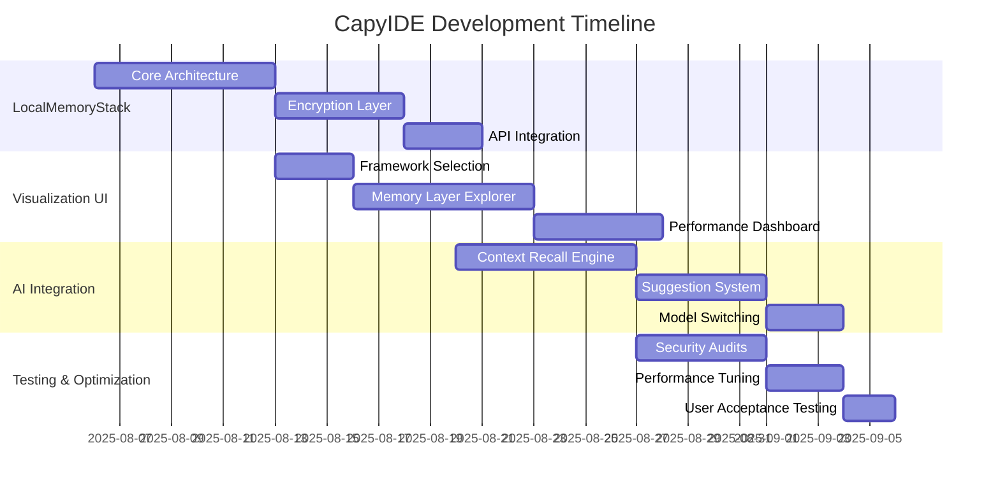
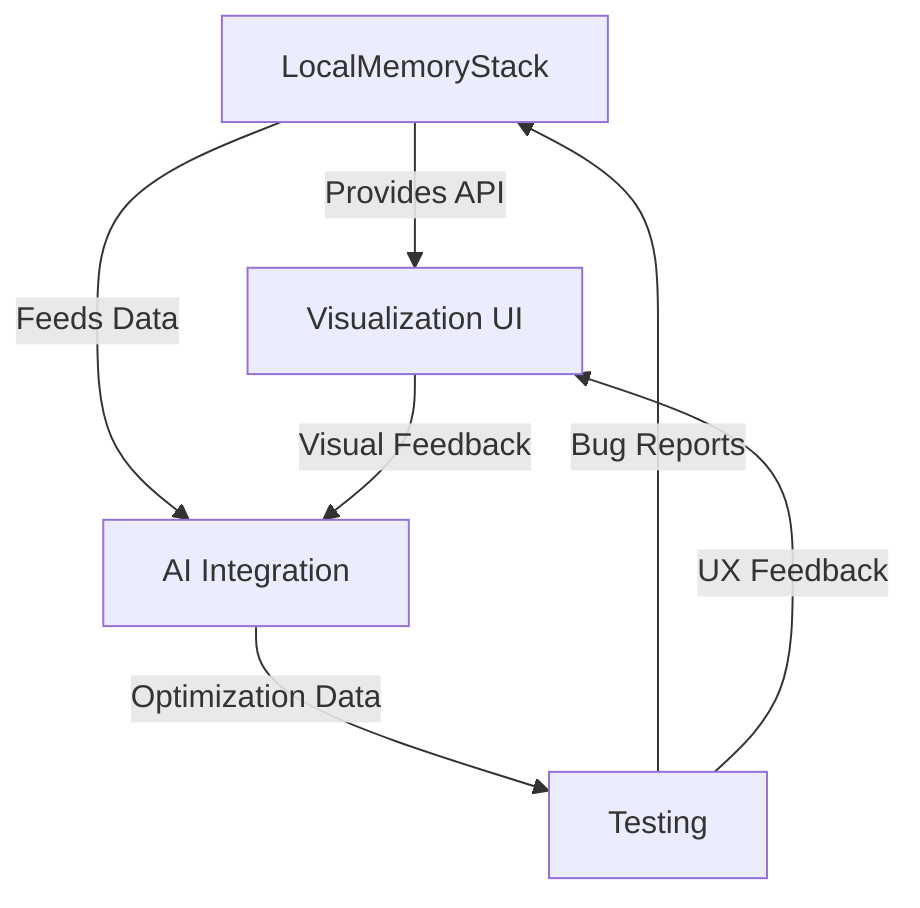

# CapyIDE 30-Day Technical Roadmap

## 1. Weekly Milestones

## 2. Component Dependencies

## 3. Resource Requirements

| Phase | Libraries/Tools | Personnel Needs |
|-------|-----------------|----------------|
| **Week 1** | Node.js, TypeScript, AES-256 | 2 Backend Devs, Security Engineer |
| **Week 2** | React, D3.js, WebGL | 2 Frontend Devs, UX Designer |
| **Week 3** | TensorFlow.js, LangChain | AI Specialist, Full-stack Dev |
| **Week 4** | Jest, Cypress, Lighthouse | QA Engineer, DevOps |

## 4. Risk Assessment

| Phase | Technical Risks | Mitigation Strategies |
|-------|-----------------|----------------------|
| **MemoryStack** | Encryption performance impact | Benchmark early, optimize C++ bindings |
| **Visualization** | Large memory dataset rendering | Implement virtual scrolling, LOD techniques |
| **AI Integration** | Context recall accuracy | Hybrid approach (vector + symbolic) |
| **Testing** | VS Code fork compatibility | Daily integration testing, feature flags |